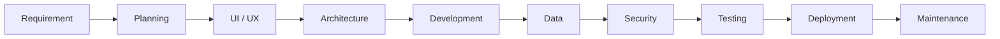

<!-- ===== HEADER ===== -->
<p align="center">
  
</p>

<p align="center">
  
</p>

<p align="center">
  <a href="https://github.com/KSukanth"></a>
  <a href="mailto:sukanthatwork@gmail.com"></a>
  <a href="https://hivonnaturals.com"></a>
  
</p>

<p align="center">
  
</p>

---

##  &nbsp;About Me

```yaml
name:       Sukanth Krishnamoorthy
role:       Full-Stack Web · App · Software Developer
building:   web apps, mobile apps, dashboards, CRM, SaaS, e-commerce
stack:      React · TypeScript · Node.js · .NET · Python · PostgreSQL · Cloud
philosophy: "Build simple. Build secure. Build for scale."
```

<table>
<tr>
<td width="50%" valign="top">

**Web & Frontend**
- Business, corporate and portfolio websites
- E-commerce storefronts and checkout flows
- Responsive, accessible interfaces

**Applications**
- Dashboards, CRM and SaaS platforms
- Admin and management systems

</td>
<td width="50%" valign="top">

**Backend & Data**
- REST APIs and business logic
- SQL / NoSQL data systems
- Authentication, roles and secure design

**Cloud & Delivery**
- Deployment, hosting and CI/CD
- Integrations: payments, email, WhatsApp
- Monitoring, automation and maintenance

</td>
</tr>
</table>

---

##  &nbsp;Tech Stack

<p align="center">
  <br/>
  <br/>
  
</p>

---

##  &nbsp;Featured Projects

<table>
<tr>
<td width="60%" valign="top">

### Hivon Naturals — E-commerce Website

A complete natural-products online store: catalogue, product pages, cart,
secure checkout, order management and an admin dashboard for inventory
and orders.

**Highlights**
- Responsive storefront with fast product browsing and search
- Cart, checkout and payment gateway integration
- Order, customer and inventory management dashboard
- SEO-friendly pages, secure APIs and cloud deployment

<p>
  
  
  
  
  
  
</p>

<a href="https://hivonnaturals.com"></a>

</td>
<td width="40%" valign="top" align="center">

<a href="https://hivonnaturals.com">
  
</a>

<sub>Live preview of hivonnaturals.com</sub>

</td>
</tr>
</table>

<table>
<tr>
<td width="50%" valign="top"><b>More coming soon</b><br/><sub>Dashboard / CRM case study</sub><br/><br/><code>React</code> <code>Node.js</code></td>
<td width="50%" valign="top"><b>More coming soon</b><br/><sub>Mobile application case study</sub><br/><br/><code>React Native</code></td>
</tr>
</table>

---

##  &nbsp;Development Workflow



---

##  &nbsp;GitHub Stats

<p align="center">
  
  
</p>

<p align="center">
  
</p>

<p align="center">
  
</p>

---

##  &nbsp;Current Focus &nbsp;·&nbsp; Learning

<table>
<tr>
<td width="50%" valign="top">

**Focus**
- Full-stack and modern web applications
- Mobile applications and cloud services
- REST API design and application security
- DevOps, CI/CD and scalable architecture

</td>
<td width="50%" valign="top">

**Learning**
- Advanced .NET and frontend architecture
- Cloud computing and system design
- Application security best practices
- AI-powered application development

</td>
</tr>
</table>

---

<p align="center">
  
</p>

##  &nbsp;Let's Connect

<p align="center">
  <a href="https://github.com/KSukanth"></a>
  <a href="mailto:sukanthatwork@gmail.com"></a>
  <a href="https://hivonnaturals.com"></a>
</p>

<p align="center">
  
</p>
